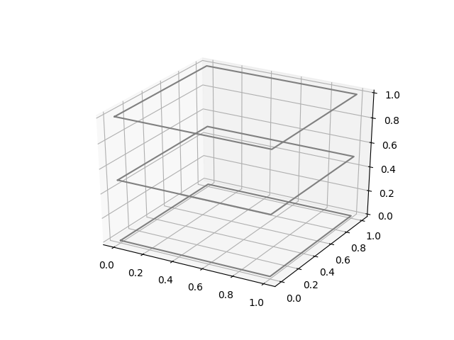

# 2d_data_on_3d_plot
Plot 2D data on 3D plot

## Setup
```
$ git clone https://github.com/hens-virtuella-varld/2d_data_on_3d_plot.git
$ cd 2d_data_on_3d_plot
(create and activate virtual environment if needed)
$ pip install -r requirements.txt
```

## Execution
```
$ python generate_cube_json.py > sample.json # This generates a sample data.
$ python plot.py sample.json cube
```

